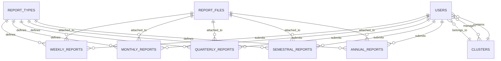

# Technical Documentation - Barangay Submission and Report System

## 🏗️ System Architecture

### **Technology Stack**
- **Backend**: Laravel 11.x (PHP 8.2+)
- **Frontend**: Blade Templates, Bootstrap 5, jQuery
- **Database**: MySQL 5.7+
- **Web Server**: Apache/Nginx
- **Real-time**: Pusher WebSockets
- **File Storage**: Laravel Storage (Local/Cloud)

### **Design Patterns**
- **MVC Architecture**: Model-View-Controller separation
- **Repository Pattern**: Data access abstraction
- **Service Layer**: Business logic encapsulation
- **Observer Pattern**: Event-driven notifications

---

## 🗄️ Database Design

### **Core Entity Relationships**



### **Table Specifications**

#### **users**
```sql
CREATE TABLE users (
    id BIGINT UNSIGNED AUTO_INCREMENT PRIMARY KEY,
    name VARCHAR(255) NOT NULL,
    email VARCHAR(255) UNIQUE NOT NULL,
    password VARCHAR(255) NOT NULL,
    user_type ENUM('admin', 'facilitator', 'barangay') NOT NULL,
    cluster_id BIGINT UNSIGNED NULL,
    is_active BOOLEAN DEFAULT TRUE,
    email_verified_at TIMESTAMP NULL,
    remember_token VARCHAR(100) NULL,
    created_at TIMESTAMP NULL,
    updated_at TIMESTAMP NULL,
    FOREIGN KEY (cluster_id) REFERENCES clusters(id)
);
```

#### **clusters**
```sql
CREATE TABLE clusters (
    id BIGINT UNSIGNED AUTO_INCREMENT PRIMARY KEY,
    name VARCHAR(255) NOT NULL,
    description TEXT NULL,
    created_at TIMESTAMP NULL,
    updated_at TIMESTAMP NULL
);
```

#### **report_types**
```sql
CREATE TABLE report_types (
    id BIGINT UNSIGNED AUTO_INCREMENT PRIMARY KEY,
    name VARCHAR(255) NOT NULL,
    frequency ENUM('weekly', 'monthly', 'quarterly', 'semestral', 'annual') NOT NULL,
    deadline DATE NOT NULL,
    instructions TEXT NULL,
    allowed_file_types JSON NULL,
    file_naming_format VARCHAR(255) NULL,
    archived_at TIMESTAMP NULL,
    created_at TIMESTAMP NULL,
    updated_at TIMESTAMP NULL
);
```

---

## 🎯 API Endpoints

### **Authentication Routes**
```php
// Authentication
POST /login                    // User login
POST /logout                   // User logout
GET  /register                 // Registration form
POST /register                 // User registration
```

### **Admin Routes**
```php
// Admin Management
GET  /admin/dashboard          // Admin dashboard
GET  /admin/users             // User management
POST /admin/users             // Create user
PUT  /admin/users/{id}        // Update user
DELETE /admin/users/{id}      // Delete user
GET  /admin/report-types      // Report type management
POST /admin/report-types      // Create report type
PUT  /admin/report-types/{id} // Update report type
DELETE /admin/report-types/{id} // Archive report type
```

### **Facilitator Routes**
```php
// Facilitator Management
GET  /facilitator/dashboard   // Facilitator dashboard
GET  /facilitator/submissions // View submissions
POST /facilitator/submissions/{id}/approve // Approve submission
POST /facilitator/submissions/{id}/reject  // Reject submission
GET  /facilitator/barangays   // Manage barangays
```

### **Barangay Routes**
```php
// Barangay Operations
GET  /barangay/dashboard      // Barangay dashboard
GET  /barangay/submit-report  // Submit report form
POST /barangay/submissions/store // Store submission
GET  /barangay/submissions    // View submissions
GET  /barangay/overdue-reports // View overdue reports
POST /barangay/submissions/{id}/resubmit // Resubmit report
```

---

## 🔧 Core Controllers

### **BarangayController**
```php
class BarangayController extends Controller
{
    public function dashboard()           // Display barangay dashboard
    public function submitReport()       // Show report submission form
    public function store(Request $request) // Process report submission
    public function submissions()        // List user submissions
    public function overdueReports()     // Show overdue reports
    public function resubmit($id)        // Handle report resubmission
    public function directDownloadFile($id) // File download
}
```

### **FacilitatorController**
```php
class FacilitatorController extends Controller
{
    public function dashboard()          // Display facilitator dashboard
    public function submissions()       // View assigned submissions
    public function approve($id)        // Approve submission
    public function reject($id)         // Reject submission
    public function managedBarangays()  // Manage assigned barangays
}
```

### **AdminController**
```php
class AdminController extends Controller
{
    public function dashboard()         // Display admin dashboard
    public function users()             // User management
    public function reportTypes()       // Report type management
    public function announcements()     // Announcement management
    public function analytics()         // System analytics
}
```

---

## 📊 Models & Relationships

### **User Model**
```php
class User extends Authenticatable
{
    // Relationships
    public function cluster()                    // Belongs to cluster
    public function assignedClusters()          // Many-to-many with clusters
    public function managedBarangays()          // Managed barangays
    public function clusterFacilitators()       // Cluster facilitators
    
    // Helper methods
    public function isFacilitator()             // Check if facilitator
    public function isBarangay()                // Check if barangay
    public function isAdmin()                   // Check if admin
}
```

### **ReportType Model**
```php
class ReportType extends Model
{
    // Scopes
    public function scopeActive($query)         // Active report types
    public function scopeArchived($query)       // Archived report types
    
    // Methods
    public function validateFilename($filename) // Validate file naming
    public function archive()                   // Archive report type
    public function unarchive()                 // Unarchive report type
}
```

---

## 🔔 Notification System

### **Notification Classes**
```php
// New submission notification
class NewSubmissionReceivedNotification extends Notification
{
    public function via($notifiable)           // Notification channels
    public function toMail($notifiable)        // Email content
    public function toDatabase($notifiable)    // Database content
}

// Deadline reminder notification
class UpcomingDeadlineNotification extends Notification
{
    public function via($notifiable)           // Notification channels
    public function toMail($notifiable)        // Email content
}

// Report remarks notification
class ReportRemarksNotification extends Notification
{
    public function via($notifiable)           // Notification channels
    public function toMail($notifiable)        // Email content
}
```

### **Notification Channels**
- **Email**: SMTP-based email notifications
- **Database**: In-app notification system
- **Real-time**: Pusher WebSocket notifications

---

## 📁 File Management

### **File Storage Configuration**
```php
// config/filesystems.php
'disks' => [
    'public' => [
        'driver' => 'local',
        'root' => storage_path('app/public'),
        'url' => env('APP_URL').'/storage',
        'visibility' => 'public',
    ],
],
```

### **File Upload Process**
1. **Validation**: File type, size, and naming format
2. **Storage**: Secure file storage with unique naming
3. **Database**: Metadata storage in report_files table
4. **Access Control**: Role-based file access permissions

### **Supported File Types**
- **Documents**: PDF, DOCX
- **Spreadsheets**: XLS, XLSX
- **Images**: JPG, JPEG, PNG
- **Archives**: ZIP, RAR

---

## 🔐 Security Implementation

### **Authentication Middleware**
```php
// Custom middleware for role-based access
class RoleMiddleware
{
    public function handle($request, Closure $next, $role)
    {
        if (!Auth::check() || Auth::user()->user_type !== $role) {
            abort(403, 'Unauthorized access.');
        }
        return $next($request);
    }
}
```

### **File Security**
```php
// File validation rules
$rules = [
    'file' => [
        'required',
        'file',
        'mimes:pdf,docx,xlsx,xls,jpg,jpeg,png,zip,rar',
        'max:25600' // 25MB max
    ]
];
```

### **CSRF Protection**
```php
// All forms include CSRF token
@csrf
// API routes protected with CSRF middleware
Route::middleware(['auth', 'csrf'])->group(function () {
    // Protected routes
});
```

---

## 🚀 Performance Optimizations

### **Database Optimizations**
```php
// Eager loading to prevent N+1 queries
$reports = WeeklyReport::with(['reportType', 'user'])
    ->where('user_id', $userId)
    ->get();

// Query optimization with indexes
DB::table('weekly_reports')
    ->where('user_id', $userId)
    ->where('created_at', '>=', $startDate)
    ->index('user_id', 'created_at')
    ->get();
```

### **Caching Strategy**
```php
// Route caching
php artisan route:cache

// View caching
php artisan view:cache

// Configuration caching
php artisan config:cache
```

### **File Optimization**
```php
// Image optimization
$image = Image::make($file);
$image->resize(800, 600)->save($path);

// File compression
$zip = new ZipArchive();
$zip->open($path, ZipArchive::CREATE);
```

---

## 🧪 Testing Framework

### **Unit Tests**
```php
// Example test case
class BarangayControllerTest extends TestCase
{
    public function test_can_submit_report()
    {
        $user = User::factory()->create(['user_type' => 'barangay']);
        $this->actingAs($user);
        
        $response = $this->post('/barangay/submissions/store', [
            'report_type_id' => 1,
            'file' => UploadedFile::fake()->create('test.pdf')
        ]);
        
        $response->assertStatus(302);
        $this->assertDatabaseHas('weekly_reports', [
            'user_id' => $user->id
        ]);
    }
}
```

### **Feature Tests**
```php
// Integration test
class ReportSubmissionTest extends TestCase
{
    public function test_complete_submission_workflow()
    {
        // Test complete workflow from submission to approval
    }
}
```

---

## 📊 Monitoring & Logging

### **Application Logging**
```php
// Log levels and channels
Log::info('Report submission successful', [
    'user_id' => $user->id,
    'report_type' => $reportType->name
]);

Log::error('File upload failed', [
    'error' => $exception->getMessage(),
    'file' => $request->file('file')->getClientOriginalName()
]);
```

### **Performance Monitoring**
```php
// Query logging
DB::enableQueryLog();
// ... database operations
$queries = DB::getQueryLog();

// Memory usage monitoring
$memoryUsage = memory_get_usage(true);
$peakMemory = memory_get_peak_usage(true);
```

---

## 🔄 Deployment Process

### **Production Deployment**
```bash
# 1. Pull latest code
git pull origin main

# 2. Install dependencies
composer install --optimize-autoloader --no-dev

# 3. Run migrations
php artisan migrate --force

# 4. Clear caches
php artisan config:cache
php artisan route:cache
php artisan view:cache

# 5. Optimize autoloader
composer dump-autoload --optimize
```

### **Environment Configuration**
```env
# .env.production
APP_ENV=production
APP_DEBUG=false
APP_URL=https://your-domain.com

DB_CONNECTION=mysql
DB_HOST=your-db-host
DB_PORT=3306
DB_DATABASE=your-database
DB_USERNAME=your-username
DB_PASSWORD=your-password

MAIL_MAILER=smtp
MAIL_HOST=your-smtp-host
MAIL_PORT=587
MAIL_USERNAME=your-email
MAIL_PASSWORD=your-password
MAIL_ENCRYPTION=tls

PUSHER_APP_ID=your-pusher-id
PUSHER_APP_KEY=your-pusher-key
PUSHER_APP_SECRET=your-pusher-secret
PUSHER_APP_CLUSTER=your-pusher-cluster
```

---

## 🛠️ Development Tools

### **Code Quality Tools**
```bash
# Laravel Pint (Code formatting)
./vendor/bin/pint

# PHPUnit (Testing)
./vendor/bin/phpunit

# Laravel Tinker (Interactive shell)
php artisan tinker
```

### **Debugging Tools**
```php
// Laravel Debugbar (Development only)
composer require barryvdh/laravel-debugbar --dev

// Telescope (Application monitoring)
composer require laravel/telescope --dev
php artisan telescope:install
```

---

## 📚 Additional Resources

### **Laravel Documentation**
- [Laravel 11.x Documentation](https://laravel.com/docs/11.x)
- [Eloquent ORM](https://laravel.com/docs/11.x/eloquent)
- [Blade Templates](https://laravel.com/docs/11.x/blade)

### **Bootstrap Documentation**
- [Bootstrap 5 Documentation](https://getbootstrap.com/docs/5.3/)
- [Bootstrap Icons](https://icons.getbootstrap.com/)

### **MySQL Documentation**
- [MySQL 8.0 Reference Manual](https://dev.mysql.com/doc/refman/8.0/en/)

---

*This technical documentation is maintained alongside the codebase and updated with each major release.*
